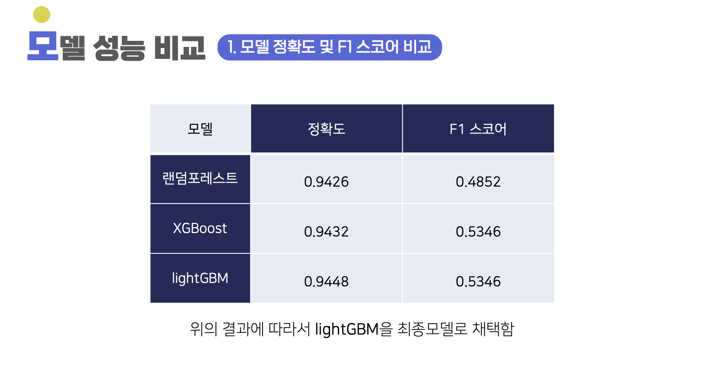

# Finda 앱 로그 기반 대출 신청 여부 예측 프로젝트
2022 빅콘테스트 데이터분석 리그 출품작입니다.

## 대회 개요
- **주최 :** 빅콘테스트 
- **주제 :** 앱 사용성 데이터를 통한 대출 신청 예측 분석 및 서비스 메시지 제안  
- **기간 :** 2022.08 ~ 2022.09
- **팀 구성 :** 4인
- **역할 :** 데이터 전처리, 군집 분석, 아이디어 기획
- **사용 언어 및 툴 :** Python, Jupyter Notebook  
- **주요 기법 :** 랜덤포레스트, XGBoost, LightGBM, K-means

## 프로젝트 개요
핀다(Finda)에서 제공한 유저 정보, 대출 승인 결과, 어플 내 로그 데이터를 기반으로 **대출 신청 여부를 예측**하고, **유저 데이터를 군집 분석**하여 타겟팅된 서비스 메시지를 제안했습니다.

## 데이터 전처리
1. **결측값 처리**
   - 근로형태, 고용형태, 주거소유형태, 대출희망금액 등 85개 행에서 중복된 결측값 제거
   - 생년월일 : 동일 유저의 결측값은 같은 값으로 대체, 나이대 변수 생성
   - 성별 : 동일 유저의 결측값은 같은 값으로 대체, 모두 NA인 경우 2로 대체
   - 신용점수 : 생성 일시의 역순 기준 대체 (17,590개 처리)
   - 연소득 : 동일 유저의 결측값을 최근 값으로 대체 (4개 처리)
2. **이상치 처리**
   - 근로형태 : 연소득과 입사연월이 없을 경우 '무직'으로 변경
   - 연소득 : 10억 이상인 경우 근로형태별 평균 연소득으로 대체
3. **변수 재설정**
   - 한글 변수명 영어로 통일
   - 개인회생자 여부와 납입완료 여부 변수 재설정

## EDA
- **원핫 인코딩 :** 행동명을 수치화하여 유저별 행동 합산
- **log-log 변환 :** 이상치 처리

## 사용한 기법
1. **대출 신청 예측**
   - **사용 모델 :** 랜덤포레스트, XGBoost, LightGBM  
   - **평가 지표 :** 정확도, 정밀도, 재현율, F1-score
   - **최종 모델 :** LightGBM (정확도 : 94.48%)
2. **군집 분석**
   - **사용 기법 :** **K-means 알고리즘** 사용
   - **군집별 특징을 파악**하고 타겟팅된 서비스 메시지 제안  

## 📈 모델 성능 비교
| 모델              | 정확도    | F1 스코어  |
|------------------|----------|------------|
| 랜덤포레스트      | 0.9426   | 0.4852     |
| XGBoost          | 0.9432   | 0.5346     |
| **LightGBM**     | **0.9448** | **0.5346** |

## 인사이트 및 서비스 제안
- **군집별 타겟팅 서비스 메시지 제안**
- **기대 효과**
  - 개인화된 마케팅 전략
  - **대출 승인율 증가** 및 **서비스 만족도 향상**

## 결론 및 한계
- **대출 신청 예측 :** 정확도 94.48%로 비교적 높은 예측 성능을 달성  
- **개선 방향**  
  - **데이터 불균형 해소 필요** : SMOTE 등 적용 검토) 
  - **다양한 모델 적용 및 하이퍼파라미터 튜닝**  
- **향후 계획**  
  - 실시간 예측 모델 구축  
  - 대출 승인 후 행동 분석 추가
